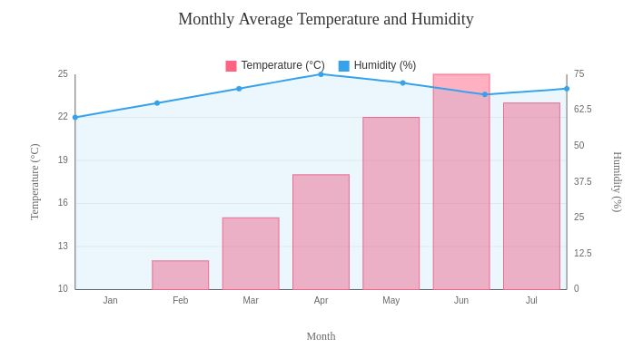

# web_libs
All my fast, light, and free Apache 2.0 licensed libraries for web front-ends!

## Dynamic-table
A fast, light, and customizable HTML table generator.

**Features:**
*   Data loading from JSON path or direct JSON data.
*   Sortable and filterable columns.
*   Custom cell rendering, including embedding charts (using PureChart.js).
*   Pagination, global search, results count, and rows-per-page selector.
*   Column visibility toggling.
*   Filter multi select
*   Darkmode

## Extended-search
A fast and light advanced search input field with flags and multi-line information.

## PureChart
A fast and light chart library.

**Features:**
*   Line
*   bar and % bar

Thank you!